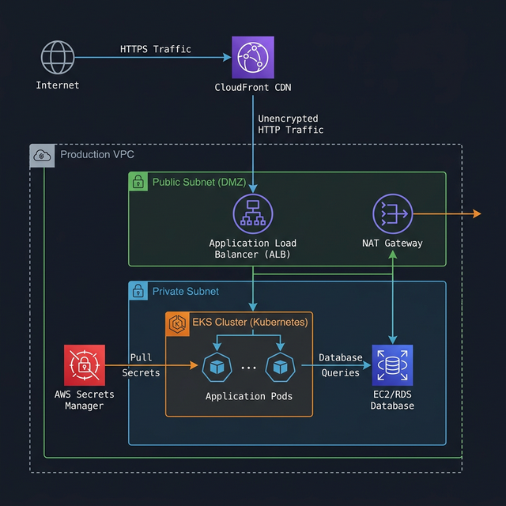

## Cloud Environment Structure

**Request:** *Recommend the optimal number and purpose of AWS accounts/GCP Projects for Innovate Inc. and justify your choice. Consider best practices for isolation, billing, and management.*

**Strategy: 2-Account Architecture (Prod / Non-Prod)**

To strike the ideal balance between management overhead, billing simplicity, and security isolation, I recommend a 2-account structure:

1.  **Non-Production Account (Dev / QA):** 
    *   **Purpose:** A sandbox environment for developers to test new features, run QA automation, and experiment. 
2.  **Production Account (Staging / Production):** 
    *   **Purpose:** Houses the live application and the pre-production staging environment.
    *   **Management:** Strict IAM access, scoped roles, and tightly controlled data access. Staging is co-located in this account so it can safely mirror production data (anonymized if necessary) and configurations, ensuring highly accurate pre-release testing.

**Justification:** While massive enterprises often use dozens of accounts via AWS Organizations/Control Tower, a 2-account model prevents billing complexity and management fatigue for leaner teams. Separation at the environment level handles the need to protect sensitive user data in Production while giving Devs the freedom they need. Resources within the accounts can be further logically separated using tags (e.g., `Env: qa`, `Env: dev`) and resource groups.

**Additional pont:** User management must be strictly done using SSO capabilities (Azure AD, Okta, etc.)
regardless of the environment. Single account with rules for password expiration, MFA, etc.

---

## Network Design & Security

**Request:** *Design the Virtual Private Cloud (VPC) architecture. Describe how you will secure the network.*

**Strategy: Private-by-Default VPC with Defense-in-Depth**

*   **Topology:** A standard 3-tier VPC architecture spread across 2-3 Availability Zones for high availability.
    *   **Public Subnets:** Contain only the NAT Gateways (for outbound internet access) and public-facing Load Balancers (ALB).
    *   **Private Subnets:** House the actual compute (EKS worker nodes) and data stores (RDS). These resources have no direct route from the internet.
*   **Traffic Routing & Edge Security:**
    *   **Single Entrypoint:** All incoming user traffic flows through a Content Delivery Network (CDN, like CloudFront) and an Application Load Balancer. 
    *   **Web Application Firewall (WAF):** AWS WAF is attached to the ALB/CDN to block common web exploits (SQLi, XSS,
     rate-limiting against DDoS). (Only prod environment has it)
    *   **Load Balancer:** Validates TLS certificates and routes API traffic directly to backend Kubernetes services. (SSL validation can be also done on Cloudfront)

### Production Environment Architecture

### SSL Termination Flow
*   **Zero-Trust Networking Posture:** 
    *   The network is entirely private. Internet traffic can only reach the Load Balancer (ports `80` redirecting to `443` HTTPS). 
    *   Security Groups on the EKS nodes strictly permit inbound traffic *only* from the Load Balancer.
    *   To keep things simple internal traffic should not contain any TLS certificates.
    *   All routing must be done with DNS records (Private ones)

---

## Compute Platform

**Request:** *Detail how you will leverage Kubernetes Service to deploy and manage the application. Describe your approach to node groups, scaling, and resource allocation. Explain your strategy for containerization...*

**Strategy: IaC-Provisioned EKS with Secure GitOps Deployments**

*   **Infrastructure Management:** All core infrastructure (VPCs, EKS clusters, Node Groups, IAM roles) is managed via **Terraform**. This ensures infrastructure is version-controlled, repeatable, and self-documenting.
*   **Dynamic Scaling & Resource Allocation:**
    *   **Production Autoscaling:** We leverage node autoscaling for rapid, cost-optimized scaling. The autoscaler observes unschedulable pods and launches exactly the right EC2 instance size/type (leveraging Spot and Graviton instances where appropriate) to fit the workload.
    *   **Non-Prod (Dev/QA):** Auto-scaling is disabled or strictly capped. The cluster runs on a fixed baseline to keep cloud costs predictably low, forcing developers to write memory-efficient code.
    *   **Pod Disruption Budgets (PDBs):** Applied to all critical deployments to ensure node consolidations or EKS upgrades never take down the application.
*   **Identity & Least Privilege (IRSA):**
    *   Pods to AWS Services: We use **IAM Roles for Service Accounts (IRSA)**. A pod needing S3 access gets a specific, scoped IAM role attached to its Kubernetes ServiceAccount. Pods *never* inherit the broad permissions of the underlying EC2 worker node.
*   **Containerization & CI/CD (GitOps):**
    *   **CI (Continuous Integration):** Application code is built into Docker images, scanned for vulnerabilities (e.g., via SonarQube), and pushed to Elastic Container Registry (ECR). Builds triggered from the `main` (or `master`) branch are automatically tagged using the specific format `release+<date>+<id>` (where `id` is an incremental counter).
    *   **CD (Continuous Deployment):** We utilize **Helm** and **werf** to manage our Kubernetes manifest templating and deployment lifecycle. Upon a new release tag, the application is **automatically deployed to the QA** environment. Deployments to **Staging and Production** environments require **manual approval/triggering**. 
    *   **Secrets Management:** Secrets are *never* stored in Git. We use the **External Secrets Operator (ESO)** to dynamically pull credentials from **AWS Secrets Manager**, or optionally a self-hosted **HashiCorp Vault**, and inject them into Kubernetes as native Secret objects.

---

## Database

**Request:** *Recommend the appropriate service for the PostgreSQL database and justify your choice. Outline your approach to database backups, high availability, and disaster recovery.*

**Strategy: Managed PostgreSQL (Amazon RDS) with Connection Pooling**

*   **Service Choice:** **Amazon RDS for PostgreSQL** or **Self-hosted on EC2**.
    *   *Justification:* **Amazon RDS** is fully managed, handling OS patching, minor version upgrades, and storage scaling seamlessly, which is ideal for minimizing operational risk. Alternatively, hosting PostgreSQL directly on an **EC2 instance** provides full control over the database environment and potential cost advantages, provided the team is prepared to handle the operational overhead (patching, backups, clustering). Self-hosting databases inside Kubernetes is generally avoided due to the risks associated with stateful workloads scaling alongside stateless pods.
*   **Connection Pooling (RDS Proxy / PgBouncer):**
    *   This can be used to multiplex and reuse connections, but its necessity **highly depends on your library choices** (e.g., whether your ORM/framework provides robust internal pooling) and traffic patterns. If your Kubernetes pods rapidly cycle up and down scaling to hundreds of replicas, direct database connections can exhaust PostgreSQL's connection limits. Otherwise, direct connections or application-level pooling may be sufficient.
*   **High Availability (HA) & Protection:**
    *   **Production:** Deployed in **Multi-AZ** configuration. RDS automatically creates a synchronous standby replica in a different AZ, guaranteeing instant failover with zero data loss.
    *   **Encryption:** Enforced Encryption-at-Rest using AWS KMS. Encryption-in-Transit (TLS) for client connections within the private network should be enforced **if dictated by the sensitivity of the data (PII/PHI)** or if required to pass formal compliance audits (such as **SOC2**, HIPAA, or PCI-DSS). Otherwise, managing TLS certificates for internal database traffic may not be strictly necessary.
*   **Backups & Disaster Recovery (DR):**
    *   **Automated Backups:** Enabled with a 30-day retention window, allowing Point-In-Time Recovery (PITR) down to the second to protect against human error (like accidental `DROP TABLE`).
    *   **Disaster Recovery:** Automated snapshots are replicated to a secondary AWS region for catastrophic region-wide failure recovery.
